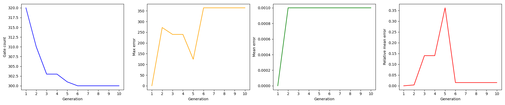

# Experiments
Raw outputs generated by script can be found in folder `/experiments`.
Below you can find visualizations of these experiments.

## Experiments with different errors
### 0%

### 0.1%

### 0.2%

### 1%

### 2%

### 10%

### 20%

